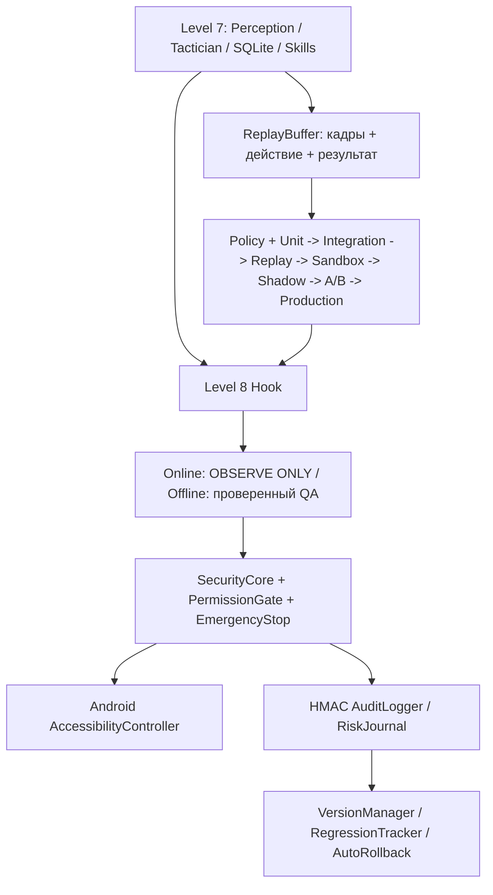

# Level 8+: Контролируемые жесты и семь ворот проверки

## Цель и границы

Level 8 — QA/Safety надстройка над Level 7 Mobile + Hub, **а не средство обхода античитов**. Модели античита и серверные алгоритмы неизвестны; «неотличимое» поведение гарантировать невозможно. Наличие игры в Shadow Mode не означает отсутствия риска блокировки аккаунта.

- Android Companion и AccessibilityController **сохранены**. Никаких новых ADB-команд для игровой автоматизации.
- SecurityCore, EmergencyStop и аудит **сохранены**. Границы жестов и разрешённые навыки проверяются прежним кодом.
- `Stage8Agent` подключается через `MobileAgent.postprocess_decision()` и `MobileAgent.on_cycle_complete()`; исходные методы по умолчанию возвращают старое поведение.
- `online=True` по умолчанию принудительно переводит все действия в `wait`.
- `HumanMimicry` выдаёт только QA-превью случайностей. Не исполняет намеренные промахи, двойные тапы и псевдосигналы.
- Для офлайн-автотеста требуется отдельное `SecurityCore.request('level8_offline_qa',...)`, даже если кто-то передал `offline_qa=True` конструктору.
- Никаких скачиваний, установок, изменения системных настроек или сетевого обмена из новых модулей без разрешения владельца.

## Диаграмма

## Что именно добавлено

`stealth/human.py` — `HumanMimicry`, диагностические распределения и плавные кривые.

`stealth/session.py` — `SessionSimulator`: добровольное ночное окно без работы и плановые перерывы для устойчивости устройства.

`stealth/detection.py` — `AntiCheatDetector`: стоп по CAPTCHA, предупреждению безопасности или потере соединения (по OCR-меткам).

`stealth/safe.py` — `SafeMode`: онлайн = только наблюдение, офлайн = явное разрешение + ограниченная частота + запрет PvP/ranked/shop.

`stealth/surveillance.py` — `CounterSurveillance`: только заявленные свойства среды, без поиска/скрытия процессов защиты и без вмешательства в трафик.

`stealth/warnings.py` — `RiskJournal` с журналом HMAC через существующий `AuditLogger`. Уровни риска условны, а не предсказания бана.

`testing/versioning.py` — неизменяемые снимки, SHA-256, подтверждённая активация, возврат к проверенному `-prod`.

`testing/replay.py` — сжатые JPEG с интервалом 0.5 с, SQLite, рамка 100 последних кадров в памяти, ротация с лимитом 50 ГБ. Не содержит функцию управления игрой.

`testing/shadow.py` — сравнение предложенных действий с добровольно записанными действиями оператора. Никаких жестов через Android.

`testing/ab.py` — Mann–Whitney U (асимптотика с учётом совпадающих рангов) или перестановочный тест с консервативной проверкой ошибок безопасности. Статистика качества не подтверждает безопасность для ToS.

`testing/regression.py` — порог 10% (направление зависит от метрики), аварийная остановка, снимок 100 кадров, откат.

`testing/orchestrator.py` — последовательные ворота с fail-closed поведением и обязательной статистикой.

`testing/policy.py` — JSON-совместимый YAML-профиль, критические модули проходят все 7 стадий. Пропуски дают LAB_ONLY и не разрешают Production.

`testing/dashboard.py` — отдельный read-only Streamlit QA Dashboard. Не имеет возможности удалённого игрового ввода.

## Требования к 7 воротам

1. Unit: pytest + покрытие критических модулей >=80% (реальный coverage.json; не ручное число).
2. Integration: подтверждённое отсутствие обхода `SecurityCore`, `EmergencyStop`, `AuditLogger`.
3. Replay: сравнение решений без отправки ввода.
4. Sandbox: >=15 минут в офлайн-игре без финансовых или иных необратимых действий.
5. Shadow: >=60 минут и >80% совпадения с реально зафиксированными действиями человека. **Не гарантия отсутствия бана**.
6. A/B: минимум 30 эпизодов на версию, статистически подтверждённое улучшение без новых ошибок безопасности.
7. Production: только для офлайн или явно разрешённой среды и после независимого согласия владельца.

Подтверждения 4–7 нельзя сгенерировать простым запуском pytest: нужны настоящие испытания и подписанные/аттестованные журналом результаты. Текущий прототип принимает `StageEvidence` от оператора и не проверяет криптографическую подпись каждого внешнего документа. До production-контроля потребуется механизм аттестации артефактов.

## Ограничения

- Тесты не предсказывают штрафы, баны, HWID-блокировки и эффективность игровых античитов.
- OCR CAPTCHA может дать пропуск или ложное срабатывание. При подозрении выбирается остановка.
- Исходы A/B нуждаются в репрезентативных, сопоставимых сериях; асимптотический p-value не исключает смещения выборки.
- Ротация файлов не учитывает резервные копии и расход SQLite WAL; целевой лимит относится к JPEG, а не всему диску.
- Android может убить Termux в фоне, а остановка не может гарантированно отменить уже начатый жест.
- Рамка `bbox` должна оставаться внутри проверенной безопасной области; намеренные промахи — исключительно неисполняемая симуляция.
