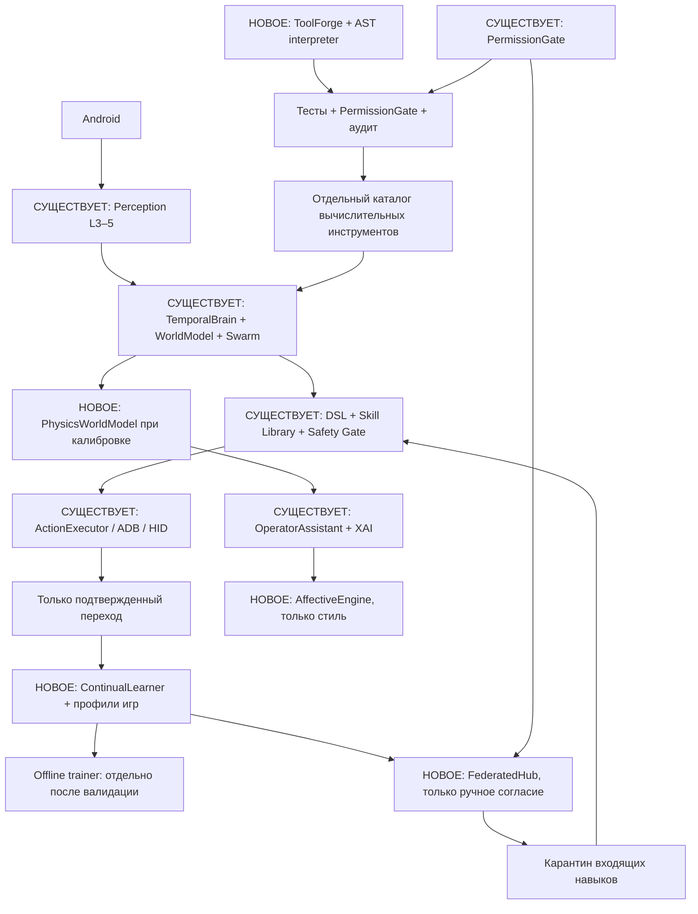

# Level 6: Continual Development & Collective Intelligence

## Схема

## Структурный контракт

- `main.py`, `main_l4.py`, `main_l5.py` сохранены как прежде.
- `game_agent/l5/agent_l5.py`: ДОБАВЛЕН только no-op `on_verified_transition` hook после фактически подтверждённого нажатия.
- `game_agent/l6/agent_l6.py`: наследует L5 и сохраняет существующий цикл.
- `continual.py`: отделяет replay-память по игровым профилям. Experience Replay препятствует забыванию лишь при **реальном** обучении с перемешиванием. Это не EWC и не гарантия сохранения точности.
- `federated.py`: аутентифицированные HMAC-конверты со строгой схемой, ограниченный список векторов и разрешённых UI-якорей. Ни скриншоты, ни OCR, ни координаты GPS, ни код не передаются. Данные псевдонимны, **не абсолютно анонимны**. Входящие навыки карантинятся до ручного принятия; их вектор не равен готовой игровой способности.
- `physics.py`: приближенная баллистика с предполагаемой ортографической плоскостью. Для перспективы потребуются параметры камеры и преобразование координат. Ни один прогноз не превращается напрямую в клик.
- `toolforge.py`: исходник предлагает модель/пользователь, затем AST-белый список, ограниченный интерпретатор, тесты и отдельное `Y` для включения вычислительного инструмента. Никакого `eval`, `exec`, произвольного Python или установки пакетов. Это не виртуальная машина и не достаточная изоляция для неподконтрольных Python-плагинов.
- `affective.py`: реагирует только на косвенные, явно включенные события ввода. Нельзя делать вывод о реальном эмоциональном состоянии пользователя. Пользовательский уровень детализации всегда имеет приоритет.

## PermissionGate (СУЩЕСТВУЕТ)

Новый Level 6 не добавляет обязательных внешних пакетов. Если выбран опциональный backend PyBullet, Torch или серверный компонент, его установку нельзя выполнять автоматически. Требуется новая запись в `DEPENDENCIES` с технической причиной, выгодой и рисками, затем отдельное подтверждение Y/N. Никаких авто-загрузок весов.

Отдельное явное подтверждение через `PermissionGate.require_external_action` необходимо для федеративной передачи и для включения инструментов ToolForge. Профили хранятся локально. Генерация исходного кода не означает право на его выполнение.

## Сохранение жизненного цикла

`Level6Agent` получает GameStateVector из L5, не перехватывает принятые решения, а собирает фактические verified transitions. Весь безопасный ActionExecutor остаётся на L5. Новые компоненты либо read-only, либо требуют отдельного одобрения. Выключение L6 не влияет на существующие скрипты.

## Риски и ограничения

1. **Катастрофическое забывание:** опыт разных игр нельзя смешивать слепо. Replay дает устойчивость только при корректной валидации и выборке; прежние веса архивировать.
2. **Федеративность:** агрегация разных игровых координат может ухудшить навык; HMAC требует управления секретами; общий сервер видит IP, время и сетевые метаданные.
3. **Физика:** расчёт столкновений будет неверен без камеры, скорости, коллизий и масштаба. Есть формула рикошета для известной нормали и коэффициента восстановления, но автоматический детектор столкновений отсутствует.
4. **ToolForge:** AST-бюджет не заменяет контейнерный sandbox для общего Python. Безопасная генерация здесь ограничена чистыми арифметическими формулами.
5. **Affective:** скорость набора и частота STOP не доказывают стресс. Микрофон по умолчанию выключен; никакая запись голоса не сохраняется.
6. **Задержки:** federated HTTP, обучение и физику нельзя запускать синхронно в цикле 0.5 секунды. Все тяжёлые задачи отделять, а устаревшие прогнозы игнорировать.
7. **Panic Stop:** если ADB/HID уже получил жест, немедленная отмена не гарантирована.

## Migrations

`PATCH_LEVEL5_TO_LEVEL6.diff` содержит точечный hook. При несовпадении L5 версий не применять патч вслепую — проверить diff и тесты. Для прямого запуска использовать `main_l6.py` или `START_L6_SAFE.cmd`.
